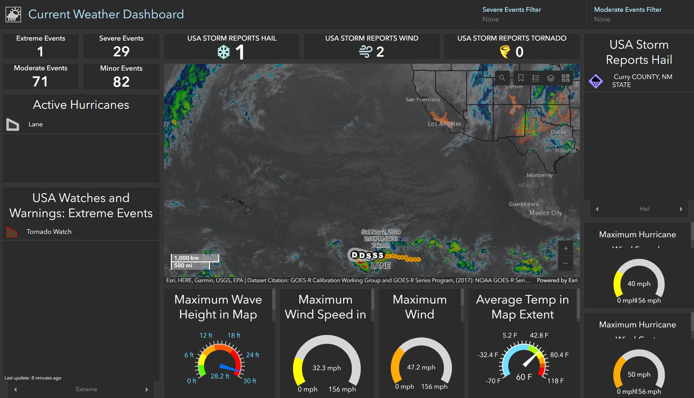

# 20 ReactfolioHub

## Your Task

Being a web developer means being part of a community. You’ll need a place not only to share your projects while you're applying for jobs or working as a freelancer but also to share your work with other developers and collaborate on projects.

Your task is to create a portfolio using your new React skills, which will help set you apart from other developers whose portfolios don’t use the latest technologies.

You’ll deploy this application to Netlify. Follow the instructions in the Git Guide or consult the [Docs on Netlify](https://vitejs.dev/guide/static-deploy.html#netlify) to create a build that you can deploy.

## User Story

```md
AS AN employer looking for candidates with experience building single-page applications
I WANT to view a potential employee's deployed React portfolio of work samples
SO THAT I can assess whether they're a good candidate for an open position
```

## Acceptance Criteria

```md
GIVEN a single-page application portfolio for a web developer
WHEN I load the portfolio
THEN I am presented with a page containing a header, a section for content, and a footer
WHEN I view the header
THEN I am presented with the developer's name and navigation with titles corresponding to different sections of the portfolio
WHEN I view the navigation titles
THEN I am presented with the titles About Me, Portfolio, Contact, and Resume, and the title corresponding to the current section is highlighted
WHEN I click on a navigation title
THEN the browser URL changes and I am presented with the corresponding section below the navigation and that title is highlighted
WHEN I load the portfolio the first time
THEN the About Me title and section are selected by default
WHEN I am presented with the About Me section
THEN I see a recent photo or avatar of the developer and a short bio about them
WHEN I am presented with the Portfolio section
THEN I see titled images of six of the developer’s applications with links to both the deployed applications and the corresponding GitHub repositories
WHEN I am presented with the Contact section
THEN I see a contact form with fields for a name, an email address, and a message
WHEN I move my cursor out of one of the form fields without entering text
THEN I receive a notification that this field is required
WHEN I enter text into the email address field
THEN I receive a notification if I have entered an invalid email address
WHEN I am presented with the Resume section
THEN I see a link to a downloadable resume and a list of the developer’s proficiencies
WHEN I view the footer
THEN I am presented with text or icon links to the developer’s GitHub and LinkedIn profiles, and their profile on a third platform (Stack Overflow, Twitter)
```

## Mock-Up

The following animation shows the web application's appearance and functionality:


# React Portfolio

This is a personal portfolio website built with React. The application showcases projects, contact information, and an About Me section. This portfolio serves as a single-page application with smooth navigation and responsive design.

## Table of Contents
- [Features](#features)
- [Installation](#installation)
- [Usage](#usage)
- [Screenshots](#screenshots)
- [Technologies](#technologies)
- [License](#license)

---

## Features
- **Responsive Design**: Adapts to various screen sizes for mobile and desktop use.
- **Dynamic Portfolio Display**: Showcases projects with links to live apps and GitHub repositories.
- **Contact Form**: Allows users to get in touch by submitting a form.
- **Easy Navigation**: Smooth navigation between About, Portfolio, Contact, and Resume sections.

## Installation
1. **Clone the repository**:
    ```bash
    git clone https://github.com/your-username/react-portfolio.git
    ```

2. **Navigate into the project directory**:
    ```bash
    cd react-portfolio
    ```

3. **Install dependencies**:
    Make sure you have [Node.js](https://nodejs.org/) and [npm](https://www.npmjs.com/) installed, then run:
    ```bash
    npm install
    ```

## Usage
1. **Run the development server**:
    ```bash
    npm run dev
    ```
    This command starts a local development server. Open [http://localhost:5173](http://localhost:5173) in your browser to view the application.

2. **Build for production**:
    To create an optimized production build, run:
    ```bash
    npm run build
    ```
    This will compile your application into the `dist` folder, ready for deployment.

3. **Deploy**:
    You can deploy the compiled app to any static hosting service such as [Netlify](https://www.netlify.com/) or [Vercel](https://vercel.com/).

## Screenshots
### Demonstration of Portfolio Section


### Contact Form


## Technologies
- **React**: Frontend JavaScript library for building user interfaces.
- **Vite**: A fast build tool that improves development speed.
- **CSS3**: Styling and layout for the user interface.

## License
This project is licensed under the MIT License.
